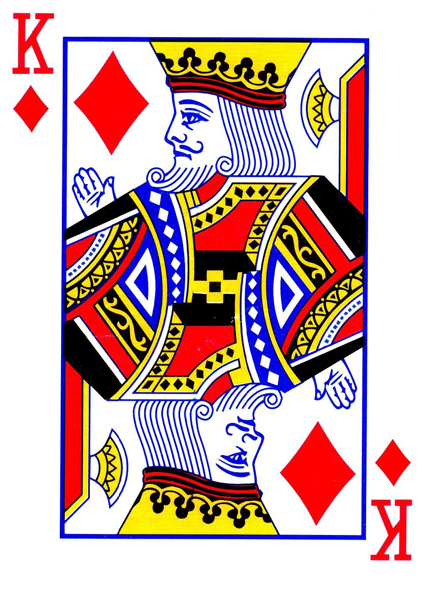

# Game 1: Balance Scale

Dựa trên một trò chơi trong *Alice in Borderland - Season 2*.
**Độ khó:** K Rô - ♦️ King of Diamonds

    

### Luật chơi
Có 5 người chơi, mỗi người sẽ được cho 10 điểm. Mỗi lượt chơi, người chơi sẽ chọn một số từ 0 đến 100. Số trung bình cộng của các số được chọn sẽ được nhân với 0,8. Người chọn số gần nhất với số này sẽ chiến thắng vòng chơi đó. Tất cả người chơi, trừ người thắng sẽ mất một điểm và vòng chơi kết thúc. Khi một người chơi có 0 điểm thì trò chơi sẽ kết thúc với người đó. Người duy nhất dương điểm đến cuối cùng là người chiến thắng.

Khi một người chơi thua, một luật mới sẽ bổ sung:

- Luật số 1: Nếu có hai người trở lên chọn cùng một số, lựa chọn của họ bị vô hiệu hóa và họ sẽ mất một điểm.

- Luật số 2: Nếu có người đoán chính xác đáp án, những người thua sẽ mất 2 điểm.

- Luật số 3: Nếu một người chọn số 0, người chọn 100 sẽ thắng.

