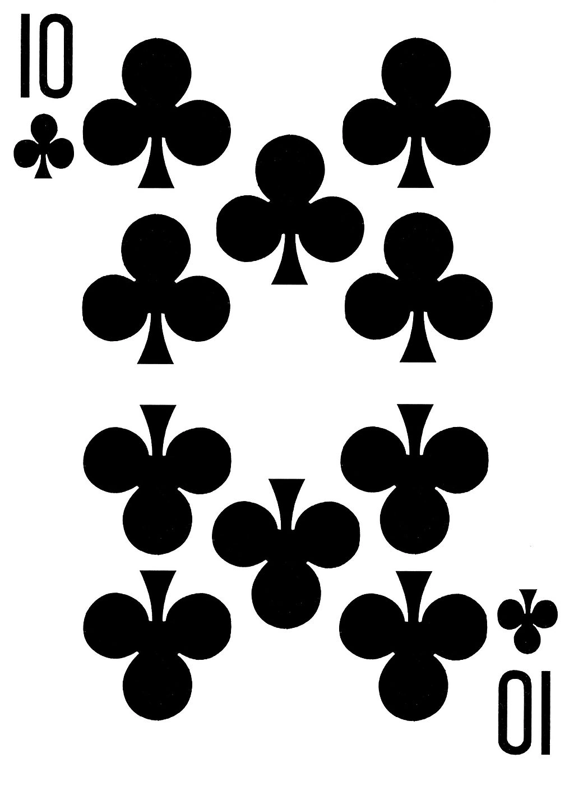

# Game 2: Bingo

Dựa trên một trò chơi trong *Alice in Borderland - Season 1*.

**Độ khó:** 10 Tép - ♣️ Ten of Clubs

    

### Luật chơi

Trò chơi được thiết kế dưới dạng một lưới 5x5 gồm tổng cộng 25 căn phòng. Ô trung tâm (vị trí giữa lưới) được để trống (coi như đặt số 0), giống như trong trò chơi Bingo truyền thống. 24 ô còn lại mỗi ô chứa một số nguyên được tạo ra ngẫu nhiên. Nhiệm vụ của người chơi là tìm các dãy số nằm theo hàng ngang, hàng dọc hoặc đường chéo sao cho tổng các số trong dãy đó là nhỏ nhất.

Mỗi lần tìm được một dãy có tổng nhỏ nhất được tính là một lần giải. Sau khi giải thành công 5 dãy, người chơi sẽ phá đảo trò chơi.