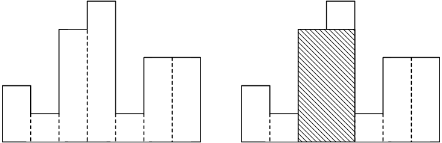

# Problem 4: HIST

Lỗ Ban là một vị thợ mộc nổi tiếng bậc nhất thời Tống của Trung Quốc với đôi bàn tay cực kỳ tài hoa khéo léo. Ngưỡng mộ tài năng của Lỗ Ban, Vua Tống mời Lỗ Ban vào triều làm quan chuyên quản lý việc thiết kế cung điện và chế tác vật dụng tinh xảo. Vua Tống trong một chuyến du ngoạn ở núi Ngũ Nhạc tình cờ phát hiện một phiến đá ngũ sắc tuyệt đẹp, Vua Tống nảy ra ý định đem phiến đá này về cung để chế tác thành một bàn cờ. Nhưng Vua Tống nhanh chóng phát hiện ra rằng, phiến đá này có hình dạng kỳ lạ rất khó để có thể cắt ra phần diện tích vuông vắn đủ lớn cho bàn cờ. Vậy là Vua Tống triệu Lỗ Ban vào triều để thương lượng:

Bề mặt phiến đá có thể được mô tả như là một hình đa giác được ghép thành từ nhiều phiến đá nhỏ hình chữ nhật có chung nhau một mép, có các chiều dài khác nay nhưng giống nhau về chiều rộng và bằng 1 đơn vị. Trong hình vẽ dưới đây, phiến đá đa giác gồm các hình chữ nhật có chiều cao lần lượt từ trái qua phải là 2,1,4,5,1,3,3 và chiều rộng đều bằng 1.

Yêu cầu: Bạn cần giúp Lỗ Ban tìm ra hình chữ nhật chung mép với các hình chữ nhật nhỏ và có diện tích lớn nhất nằm trong phiến đá đa giác nói trên. Ở hình vẽ dưới, hình chữ nhật lớn nhất là hình được gạch chéo.

### Input
Chứa một hoặc nhiều test. Mỗi test mô tả một đa giác bắt đầu bằng số nguyên `n (1 <= n <= 1000000)`  là số lượng hình chữ nhật nhỏ cấu thành đa giác. Tiếp theo sau `n` là số nguyên  với  lần lượt từ trái sang phải biểu thị chiều dài của các hình chữ nhật. Chiều rộng của các hình chữ nhật bằng nhau và bằng `1`. File kết thúc với dòng ghi duy nhất một số `0`.

### Output
Với mỗi test ghi trên một dòng diện tích của hình chữ nhật nằm trong đa giác thỏa mãn điều kiện đề bài.
### Examples
| Input | Output |
| --- | --- | 
| `2 0 0`   `3 0 0 0`   `4 0 1 0 1`   `5 1 0 1 0 1`   `6 2 0 1 0 1 0`   `0` | `0`   `0`   `1`   `1`   `2` | 